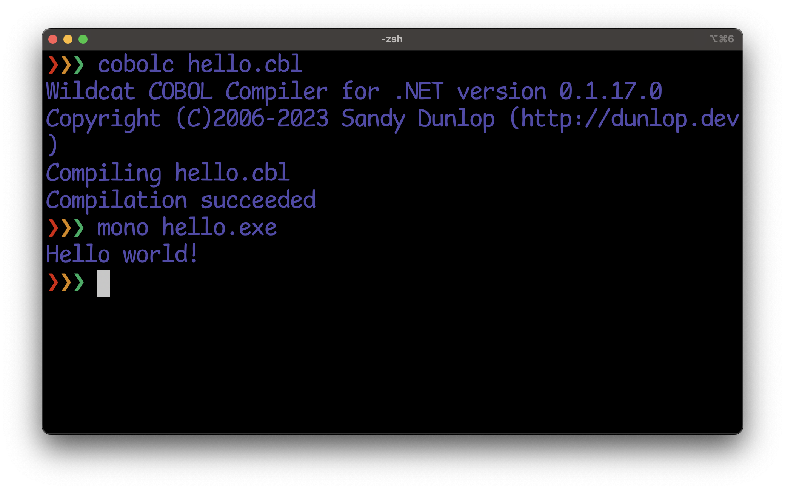

### Wildcat COBOL Compiler

Wildcat COBOL Compiler is a COBOL compiler that works with [.NET 7](https://dotnet.microsoft.com/en-us/download/dotnet/7.0) on Windows, Mac, and Linux.



Building the project creates a NuGet package.

To install the compiler as a global dotnet tool. run the following command from the project directory:

```
dotnet tool install --global --add-source ./nupkg cobolc
```
